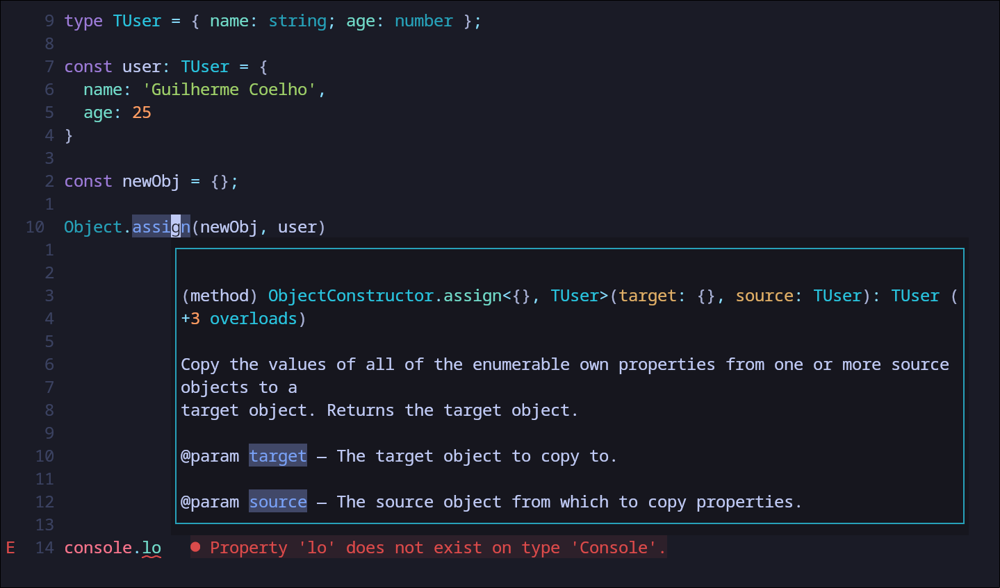

# Neovim Editor



>[!IMPORTANT]
> Make sure have installed `nvim 0.12 version` or highter

This config use `native package manager` and minimal LSP setup.

- To install this:

```
git clone https://github.com/guicoelhodev/nvim-setup.git nvim &&
mv nvim ~/.config/nvim
```


### How to install nvim 0.12 nightly version?

First of all, go to nvim releases and download **AppImage**

[https://github.com/neovim/neovim/releases]('neovim-releases')

1.  Download nvim-linux-x86_64.appimage
2.  Run `chmod u+x nvim-linux-x86_64.appimage && ./nvim-linux-x86_64.appimage`


